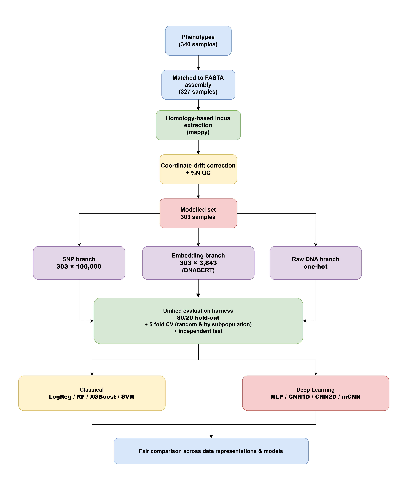

<div align="center">

[🇻🇳 Tiếng Việt](README.vn.md) · **🇬🇧 English**

</div>

# Predicting Rice Bacterial Blight (Xoo) Resistance from Genomic Data

A fair comparison of **three genomic feature representations** — whole-genome SNPs, DNA language-model embeddings (Plant-DNABERT), and raw one-hot DNA — for predicting resistance to *Xanthomonas oryzae* pv. *oryzae* (Xoo) across 303 rice accessions, under a **population-structure-leakage-controlled** evaluation protocol.

> 📌 **Track progress & research sources:** [Bioinformatic Thesis — Notion](https://app.notion.com/p/Bioinformatic-Thesis-3809ee45bd5180dead05cef7c138b6c1)

---

## Pipeline overview

<p align="center">
  
</p>

<p align="center">
  <em>Figure: Overview of the genomic preprocessing, feature representation, and model evaluation pipeline.</em>
</p>

**Task:** binary classification — R/MR = resistant (1), MS/S = susceptible (0) — for three Xoo strains (C4, C5, P9a).

**Key findings:**
- **Classical models outperform deep learning on all three branches** (independent test: AUC 0.793 vs 0.708).
- **SNPs give the highest AUC but leak the most population structure** (Δ=0.104); embeddings are more honest (Δ=0.075) → a trade-off between *apparent performance* and *scientific reliability*.
- A subpopulation-only baseline reaches AUC ~0.75 under random CV but collapses to 0.5 under grouped CV — showing much of the "strong" performance is leakage, not genuine resistance signal.

---

## Results at a glance (independent test, averaged over 3 strains)

| Branch | Best model | AUC | MCC | F1 |
|---|---|---|---|---|
| SNP (100k) | XGBoost | **0.848** | 0.494 | 0.695 |
| Embedding (DNABERT) | RandomForest | 0.780 | 0.336 | 0.585 |
| Raw DNA (one-hot) | mCNN | 0.714 | 0.288 | 0.612 |

Full details: see [`docs/TONG_HOP_PIPELINE_KETQUA.md`](docs/TONG_HOP_PIPELINE_KETQUA.md) and `results_ALL_3branch.csv`.

---

## ⚠️ Notes for running the notebook on Google Colab

`Bacterial_Blight_Leaf_Pipeline.ipynb` was written for Colab. Read before running:

### 1. Enable GPU
The embedding step (Plant-DNABERT) and the deep models require a GPU.
`Runtime → Change runtime type → Hardware accelerator → GPU` (a T4 is sufficient).

### 2. Mount Google Drive & set paths
The notebook reads/writes on Drive. Edit the path variables to match your Drive:
```python
from google.colab import drive
drive.mount('/content/drive')

# consensus genomes (.fasta.gz) — input data
DATA = '/content/drive/MyDrive/consensus_results'
# output directory
OUT  = '/content/drive/MyDrive/Project/Bioinformatics'
```

### 3. Install libraries not preinstalled on Colab
```bash
pip install mappy pyfaidx bed_reader transformers biopython
```
(`torch`, `scikit-learn`, `xgboost`, `pandas`, `numpy` are usually already available.)

### 4. Run cells IN ORDER
There is a **"base cell"** defining shared functions (`get_split`, `eval_sklearn`, `_metrics`) that **must run before any model cell**, otherwise you'll hit missing-function errors. General order:
```
setup & mount → load phenotypes → homology extraction → %N QC
→ embedding → load SNPs → base cell → per-branch eval cells
```

### 5. Checkpointing & runtime
- The embedding step saves `embeddings_partial.npz` and **resumes automatically** if Colab disconnects — just re-run the cell.
- SNP loading reads ~4.8M SNPs in chunks (~30 s).
- The deep harness repeats 20× (mCNN 5×) → a few minutes per branch.

### 6. Reproducibility
- Fixed `SEED=42` for splits and CV.
- **Deep results are mean±std over repeats**, so absolute numbers may shift slightly across runs / GPUs; the trends (classical>deep, leakage ordering) are stable.

### 7. Data
The consensus genomes and SNP matrix are **not included in the repo** (too large). Source: the 3,000 Rice Genomes Project; phenotypes from Lu et al. Place the files on Drive per section 2.

---

## Evaluation protocol (summary)

| Scheme | Split | Meaning |
|---|---|---|
| Hold-out | 80/20 stratified (242 train / 61 test), seed 42 | internal independent test, used once at the end |
| Random CV | StratifiedKFold(5) on the 242 train | **optimistic** upper bound (may borrow population structure) |
| Grouped CV | GroupKFold(5) by `subgroup` | **honest** estimate (whole subpopulations held out) |

Primary metrics: **AUC + MCC** (accuracy avoided — C5 is 18.5% imbalanced). Leakage metric: `Δ = AUC(random CV) − AUC(grouped CV)`. Classical models run once (deterministic); deep models repeat 20× (mCNN 5×) and report mean±std.

---

## Repository structure (suggested)

```
.
├── Bacterial_Blight_Leaf_Pipeline.ipynb   # main notebook
├── README.md                              # Vietnamese
├── README.en.md                           # English
├── docs/
│   └── TONG_HOP_PIPELINE_KETQUA.md         # detailed pipeline & results
├── results/
│   └── results_ALL_3branch.csv             # all metrics (171 rows)
└── figures/                                # figures for report/paper
```
*(Raw data and `.npz` feature matrices live on Drive, not committed to GitHub.)*

---

## Documentation & progress

All research progress, experiment logs, and reference sources are tracked on Notion:
**[Bioinformatic Thesis](https://app.notion.com/p/Bioinformatic-Thesis-3809ee45bd5180dead05cef7c138b6c1)**

---

## Citation

*(to be updated once the ISDS 2026 paper is accepted)*

## License

*(add a LICENSE — e.g. MIT — if you plan to make it public)*
