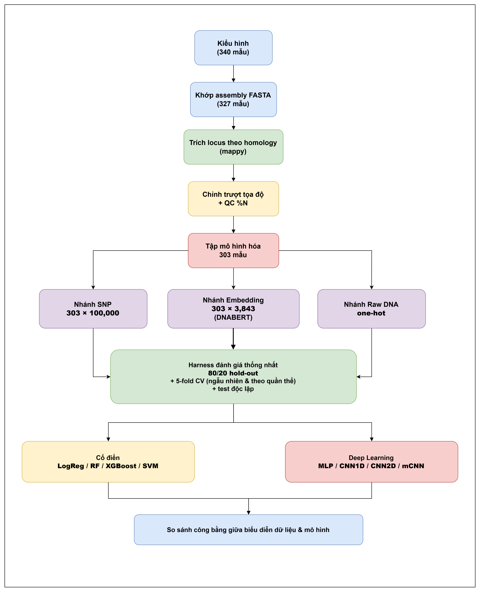

<div align="center">

**🇻🇳 Tiếng Việt** · [🇬🇧 English](README.md)

</div>

# Dự đoán tính kháng bệnh bạc lá lúa (Xoo) từ dữ liệu bộ gen

So sánh công bằng **ba cách biểu diễn đặc trưng gen** — SNP toàn genome, embedding từ mô hình ngôn ngữ DNA (Plant-DNABERT), và DNA thô one-hot — cho bài toán dự đoán tính kháng *Xanthomonas oryzae* pv. *oryzae* (Xoo) trên 303 giống lúa, dưới một quy trình đánh giá **chống rò rỉ cấu trúc quần thể**.

> 📌 **Theo dõi tiến độ & nguồn tài liệu nghiên cứu:** [Bioinformatic Thesis — Notion](https://app.notion.com/p/Bioinformatic-Thesis-3809ee45bd5180dead05cef7c138b6c1)

---

## Tổng quan pipeline

<p align="center">
  
</p>

<p align="center">
  <em>Hình: Tổng quan về quy trình xử lý gen, tính trạng và chất lượng các mô hình.</em>
</p>

**Bài toán:** phân loại nhị phân R/MR = kháng (1), MS/S = nhiễm (0), cho 3 chủng Xoo (C4, C5, P9a).

**Phát hiện chính:**
- Mô hình **cổ điển vượt deep learning ở cả 3 nhánh** (test độc lập: AUC 0.793 vs 0.708).
- **SNP cho AUC cao nhất nhưng rò rỉ cấu trúc quần thể nhiều nhất** (Δ=0.104), embedding trung thực hơn (Δ=0.075) → trade-off giữa *hiệu năng biểu kiến* và *độ tin cậy khoa học*.
- Baseline chỉ-dùng-quần-thể đạt AUC ~0.75 dưới CV ngẫu nhiên nhưng về 0.5 dưới CV theo nhóm — cho thấy phần lớn "hiệu năng đẹp" là rò rỉ, không phải tín hiệu kháng thật.

---

## Kết quả tóm tắt (test độc lập, trung bình 3 chủng)

| Nhánh | Model tốt nhất | AUC | MCC | F1 |
|---|---|---|---|---|
| SNP (100k) | XGBoost | **0.848** | 0.494 | 0.695 |
| Embedding (DNABERT) | RandomForest | 0.780 | 0.336 | 0.585 |
| Raw DNA (one-hot) | mCNN | 0.714 | 0.288 | 0.612 |

Chi tiết đầy đủ: xem [`docs/TONG_HOP_PIPELINE_KETQUA.md`](docs/TONG_HOP_PIPELINE_KETQUA.md) và `results_ALL_3branch.csv`.

---

## ⚠️ Lưu ý khi chạy notebook trên Google Colab

Notebook `Bacterial_Blight_Leaf_Pipeline.ipynb` được viết cho môi trường Colab. Đọc kỹ trước khi chạy:

### 1. Bật GPU
Bước embedding (Plant-DNABERT) và các mô hình deep cần GPU.
`Runtime → Change runtime type → Hardware accelerator → GPU` (T4 là đủ).

### 2. Mount Google Drive & chỉnh đường dẫn
Notebook đọc/ghi trên Drive. Sửa các biến đường dẫn cho khớp Drive của bạn:
```python
from google.colab import drive
drive.mount('/content/drive')

# genome consensus (.fasta.gz) — dữ liệu đầu vào
DATA = '/content/drive/MyDrive/consensus_results'
# thư mục xuất kết quả
OUT  = '/content/drive/MyDrive/Project/Bioinformatics'
```

### 3. Cài các thư viện không có sẵn trên Colab
```bash
pip install mappy pyfaidx bed_reader transformers biopython
```
(`torch`, `scikit-learn`, `xgboost`, `pandas`, `numpy` thường đã có sẵn.)

### 4. Chạy cell ĐÚNG THỨ TỰ
Có một **"CELL NỀN"** định nghĩa các hàm dùng chung (`get_split`, `eval_sklearn`, `_metrics`) — **phải chạy trước mọi cell model**, nếu không sẽ báo lỗi thiếu hàm. Thứ tự tổng quát:
```
setup & mount → nạp kiểu hình → trích locus (homology) → QC %N
→ embedding → nạp SNP → cell nền → các cell eval theo từng nhánh
```

### 5. Checkpoint & thời gian chạy
- Bước embedding lưu `embeddings_partial.npz` và **tự chạy tiếp** nếu Colab ngắt kết nối — cứ chạy lại cell.
- Nạp SNP đọc ~4.8 triệu SNP theo khối (~30 giây).
- Harness deep lặp 20 lần (mCNN 5 lần) → có thể mất vài phút mỗi nhánh.

### 6. Tái lập
- Seed cố định `SEED=42` cho chia tập và CV.
- **Kết quả deep là mean±std qua nhiều lần lặp** nên con số tuyệt đối có thể xê dịch nhẹ giữa các lần chạy / GPU khác nhau; xu hướng (cổ điển>deep, thứ tự rò rỉ) ổn định.

### 7. Dữ liệu
Genome consensus và ma trận SNP **không kèm trong repo** (dung lượng lớn). Nguồn: 3,000 Rice Genomes Project; kiểu hình theo Lu et al. Đặt file vào Drive theo đường dẫn ở mục 2.

---

## Quy trình đánh giá (tóm tắt)

| Kiểu | Cách chia | Ý nghĩa |
|---|---|---|
| Hold-out | 80/20 stratified (242 train / 61 test), seed 42 | test độc lập nội bộ, dùng 1 lần cuối |
| CV ngẫu nhiên | StratifiedKFold(5) trên 242 train | cận trên **lạc quan** (có thể mượn cấu trúc quần thể) |
| CV theo quần thể | GroupKFold(5) theo `subgroup` | ước lượng **trung thực** (giữ nguyên khối subpopulation ra ngoài) |

Metric chính: **AUC + MCC** (không dùng accuracy vì C5 lệch 18.5%). Chỉ số rò rỉ: `Δ = AUC(CV ngẫu nhiên) − AUC(CV nhóm)`. Model cổ điển chạy 1 lần (tất định); deep lặp 20 (mCNN 5) báo mean±std.

---

## Cấu trúc repo (gợi ý)

```
.
├── Bacterial_Blight_Leaf_Pipeline.ipynb   # main notebook
├── README.md                              # English
├── README.vn.md                           # Vietnamese
├── Data_export/          # detailed pipeline & results
├── Evaluation_results/
│   └── results_ALL_3branch.csv             # all metrics (171 rows)
└── Images/                                # figures for report/paper
```
*(Dữ liệu thô và feature matrix `.npz` để trên Drive, không commit lên GitHub.)*

---

## Tài liệu & tiến độ

Toàn bộ tiến độ nghiên cứu, nhật ký thí nghiệm và các nguồn tài liệu tham khảo được theo dõi tại Notion:
**[Bioinformatic Thesis](https://app.notion.com/p/Bioinformatic-Thesis-3809ee45bd5180dead05cef7c138b6c1)**

---

## Tài liệu tham khảo

[1] Lu J. et al. (2021). GWAS dissects resistance loci against bacterial blight… *Rice* 14:22. DOI: 10.1186/s12284-021-00462-3. [Link](https://link.springer.com/article/10.1186/s12284-021-00462-3)

[2] Iyer A.S. & McCouch S.R. (2004). *MPMI* 17(12):1348–1354. (xa5 = TFIIAγ5). [Link](https://pubmed.ncbi.nlm.nih.gov/15597740/)

[3] Jiang G. et al. (2006). *Mol Genet Genomics* 275:354–366. (xa5 complementation). [Link](https://link.springer.com/article/10.1007/s00438-005-0091-7)

[4] Hu K. et al. (2017). Xa4 encodes a wall-associated kinase. (Xa4 = WAK, chr11). [Link](https://pubmed.ncbi.nlm.nih.gov/28211849/)

[5] Li M. et al. (2025). Xa50(t) in the Xa4 locus. *Front Plant Sci*. DOI: 10.3389/fpls.2025.1657476. [Link](https://www.frontiersin.org/journals/plant-science/articles/10.3389/fpls.2025.1657476/full)

[6] Kim S.-M. & Reinke R.F. (2019). Xa43(t) by GWAS + QTL. *PLoS ONE*. DOI: 10.1371/journal.pone.0211775. (chr11:27.83–27.95 Mb). [Link](https://journals.plos.org/plosone/article?id=10.1371/journal.pone.0211775)

[7] Kim S.-M. et al. (2018). xa44(t) by QTL linkage. *Theor Appl Genet*. (chr11:28.0–28.12 Mb). [Link](https://pmc.ncbi.nlm.nih.gov/articles/PMC6244528/)

[8] ULR207 QTL-seq (2025). qtlBBchr8 (chr8:0–5 Mb). *Plants*. [Link](https://pmc.ncbi.nlm.nih.gov/articles/PMC12298398/)

[9] Kawahara Y. et al. (2013). IRGSP-1.0 reference. *Rice* 6:4. [Link](https://link.springer.com/article/10.1186/1939-8433-6-4)

[10] Yoshimura et al. (1998). Expression of Xa1, a bacterial blight-resistance gene in rice, is induced by bacterial inoculation.

[11] Song et al. (1995). A receptor kinase-like protein encoded by the rice disease resistance gene, Xa21.

[12] Sun et al. (2004). Xa26 encodes an LRR receptor kinase-like protein conferring bacterial blight resistance.

[13] Jiang et al. (2006). Genetic complementation of xa5 and comparison of the TFIIAγ genes in rice.

[14] Tian et al. (2014). The rice TAL effector-dependent resistance protein XA10 triggers cell death and calcium depletion in the endoplasmic reticulum.

[15] Chu et al. (2006). Promoter mutations of an essential gene for pollen development result in disease resistance in rice.

[16] Wang et al. (2015). XA23 is an executor R protein and confers broad-spectrum disease resistance in rice.

[17] Liu et al. (2011). A paralog of the MtN3/saliva family recessively confers race-specific resistance to *Xanthomonas oryzae* in rice.

[18] Gu et al. (2005). R gene expression induced by a type-III effector triggers disease resistance in rice.


## Giấy phép

Copyright (c) 2026 THACH THANH NHI

This project is licensed under the MIT License.
